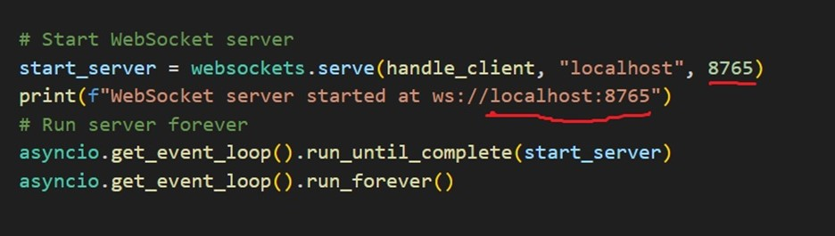
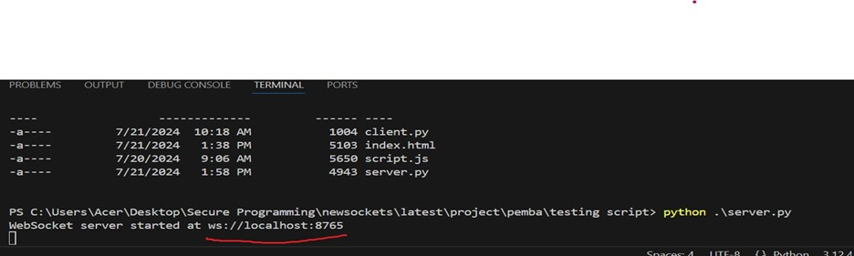
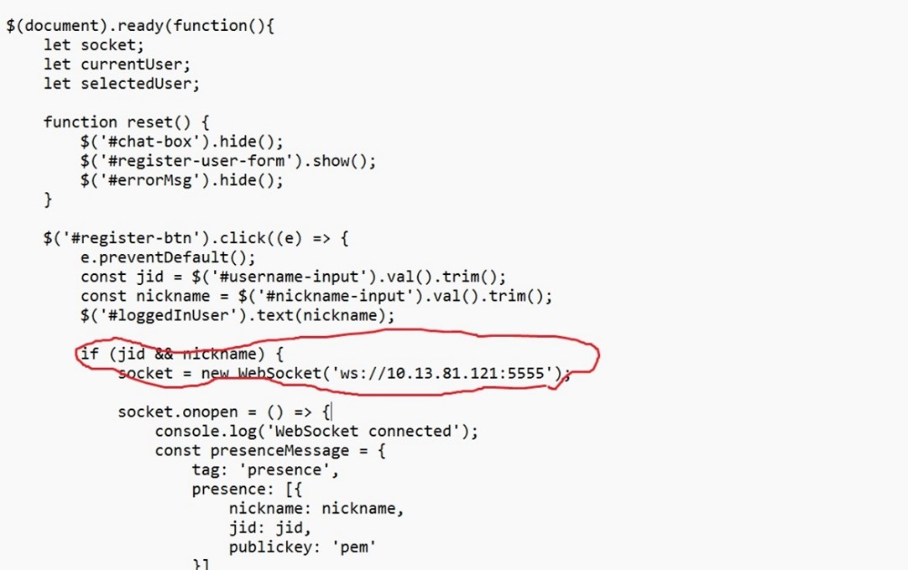
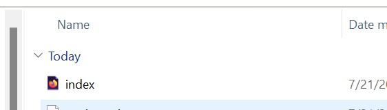
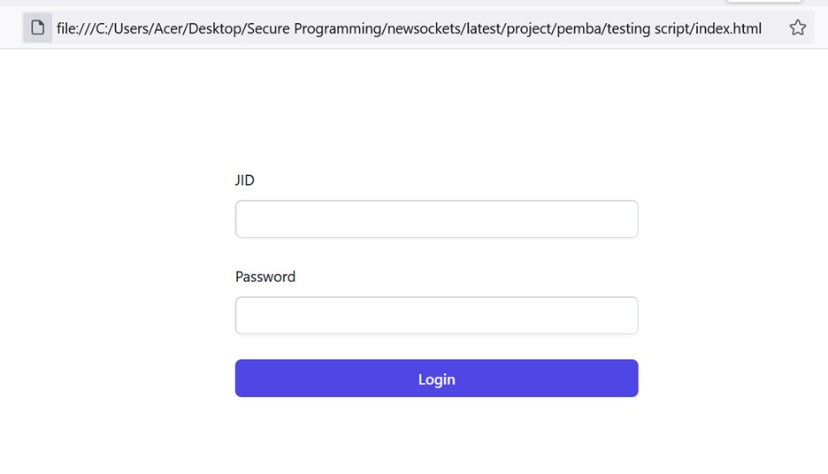
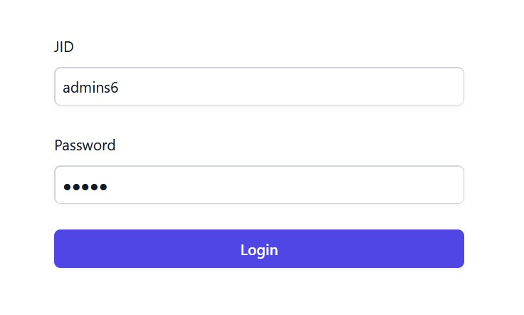
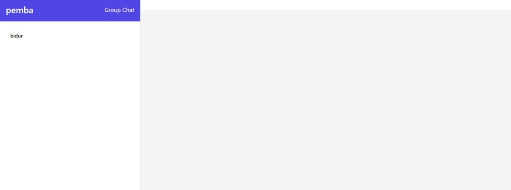
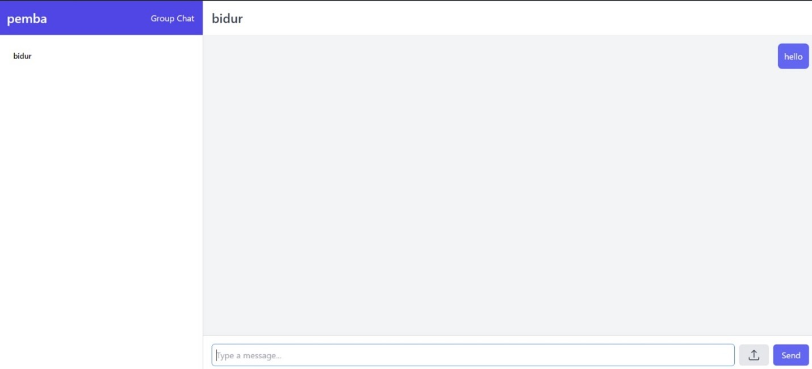
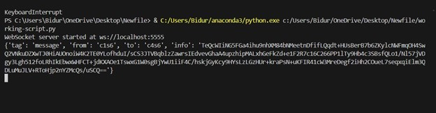

# Online Chat Application

## Introduction

'Online-chat' is a browser-based web chat application utilizing layer 7 protocols, specifically WebSocket. The WebSocket protocol facilitates end-to-end messaging between two clients over a network, offering a reliable full-duplex communication channel over TCP. This enables real-time communication between the client and server, supporting the following features:

•⁠  ⁠User login
•⁠  ⁠List of online users
•⁠  ⁠Private messaging between users
•⁠  ⁠Group (broadcast) messages to all online users
•⁠  ⁠Peer-to-peer file transfer

## Technologies Used

The application is developed with Python for server-side scripting, and JavaScript and HTML for the client-side. This combination ensures the application is resource-efficient and user-friendly.

## Prerequisites

To run this application, the following dependencies and scripts are required:

1.⁠ ⁠Download the ⁠ Server.py ⁠ script.
2.⁠ ⁠Ensure all clients are on the same subnet or connected via a hotspot for testing.

### Server-side Prerequisites

#### Installing Python

For Linux, use the following commands to install the required dependencies:
⁠```
apt update
apt install python3.8 python3.8-venv python3.8-dev
⁠```

For Windows:
1.⁠ ⁠Download the Python installer from the official [Python website](https://www.python.org/downloads/).
2.⁠ ⁠Run the installer and ensure the path is correctly defined by checking the "Add Python to PATH" option.

For macOS:
⁠```
brew update
brew install python@3.8
```
 ⁠

Install the necessary Python libraries:
⁠```
pip install websockets
⁠```

After successfully installing all dependencies, configure the IP address and domain on the server side.

### Client-side Prerequisites

Download the client scripts. No additional dependencies are required for the client side.

## Configuration Changes

### Server-side Configuration

Update the ⁠ server.py ⁠ file with your laptop/PC IP address and port number ⁠ <IP Address> ⁠ and ⁠ <5555> ⁠ respectively. After making the necessary changes, run the script:
⁠```
python server.py
```
 ⁠
You should see output indicating that your IP address is associated with port 5555 instead of ⁠ ws://localhost:8765 ⁠.



### Client-side Configuration

Download the ⁠ index.html ⁠ script and make the necessary changes in the file. Open the ⁠ <script> ⁠ file and update the IP address to match your PC/Laptop's IP address in the highlighted section ⁠ <10.13.81.121> ⁠, keeping the port unchanged.

To find your IP address, use ⁠ ipconfig ⁠ for Windows or ⁠ ifconfig ⁠ for Linux, and update it in the script accordingly.

Double-click on the ⁠ index.html ⁠ file to open it.



There are 2 test user to test the functionalities with admin priveliges. The index page will prompt for a jid and password for login. Use the following credentials:
```
⁠Username: test1@s6
⁠Password: ⁠ test1@s6⁠
```

```
⁠Username: test1@s6
⁠Password: ⁠ test1@s6⁠
```

After logging in, the main chat room will appear, showing the online users. In the example below, the users ⁠ pemba ⁠ and ⁠ bidur ⁠ are online.



The online chat between two clients is displayed as follows:



The message below indicates encryption between clients.





## Application Screenshots

Below are additional screenshots of the application in use:







This documentation provides a comprehensive guide to setting up and using the 'Online-chat' application, ensuring a seamless and secure communication experience.