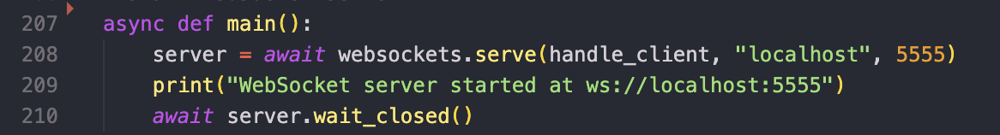

# Online Chat Application

## Introduction

'Online-chat' is a browser-based web chat application utilizing layer 7 protocols, specifically WebSocket. The WebSocket protocol facilitates end-to-end messaging between two clients over a network, offering a reliable full-duplex communication channel over TCP. This enables real-time communication between the client and server, supporting the following features:

- User login
- List of online users
- Private messaging between users
- Group (broadcast) messages to all online users
- Peer-to-peer file transfer

## Technologies Used

The application is developed with Python for server-side scripting, and JavaScript and HTML for the client-side. This combination ensures the application is resource-efficient and user-friendly.

## Prerequisites

To run this application, the following dependencies and scripts are required:

1. Download the `server.py` script.
2. Ensure all clients are on the same subnet or connected via a hotspot for testing.

### Server-side Prerequisites

#### Installing Python

For Linux, use the following commands to install the required dependencies:
```sh
apt update
apt install python3.8 python3.8-venv python3.8-dev
```

For Windows:
1. Download the Python installer from the official [Python website](https://www.python.org/downloads/).
2. Run the installer and ensure the path is correctly defined by checking the "*Add Python to PATH*" option.

For macOS:
```sh
brew update
brew install python@3.8
```

Install the necessary Python libraries:
```sh
pip install websockets
```

After successfully installing all dependencies, configure the IP address and domain on the server side.

### Client-side Prerequisites

Download the client scripts. No additional dependencies are required for the client side.

## Configuration Changes

### Server-side Configuration

Update the `server.py` file with your laptop/PC IP address and port number `<IP Address>` and `<5555>` respectively. After making the necessary changes, run the script:
```sh
python server.py
```
You should see output indicating that your IP address is associated with port 5555 instead of `ws://localhost:5555`.


### Client-side Configuration

Download the `index.html` script and make the necessary changes in the file. You can change localhost to your Laptop/PC IP in `server.py` and `script.js`



To find your IP address, use `ipconfig` for Windows or `ifconfig` for Linux, and update it in the script accordingly.

Double-click on the `index.html` file to open it.


We have created some test users with admin priveledge. The index page will prompt for a jid and password for login. Use the following credentials:
```sh
Username: test1@s6
Password: test1@s6
```
```sh
Username: test2@s6
Password: test2@s6
```

After logging in, the main chat room will appear, showing the online users. In the example below, the users `test1` and `test2` are online.


The online chat between two clients is displayed as follows:


Test 1 sent message to Test 2

Test 2 received message from Test 1

### Some Screenshots of Group Chat
To start group chat we need to click on Group Chat 


This documentation provides a comprehensive guide to setting up and using the 'Online-chat' application, ensuring a seamless and secure communication experience.
